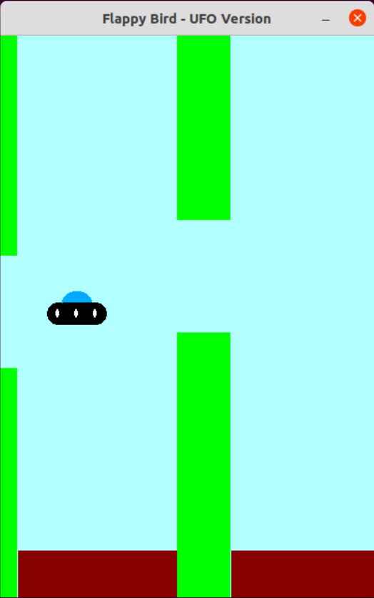

<h1>Arcade Cabinet</h1>

<h3>Snake Game</h3>


Snake game with variable length and pace, randomly placed (& shaped) eatables. Eating increases length and speed.<br>
Use keys ```a``` and ```l``` to change the snake's direction of motion.<br>
The boundary acts as a barrier - hitting it ends the game.

(Use FLTK : https://www.fltk.org/)<br>
Run using ```./window``` (pre-compiled)<br>
To compile, use ```fltk-config --compile window.cpp```

<h3>Flappy UFO (Bird)</h3>



Side-scroller Flappy UFO Game. Maneuver the UFO through obstacles at random heights. Hitting a pillar ends the game.<br>
Move against gravity using key ```a```!

(Use FLTK : https://www.fltk.org/)<br>
Run using ```./window``` (pre-compiled)<br>
To compile, use ```fltk-config --compile window.cpp```

<h3>Infinite Runner</h3>


Take the pixelated character through the landscape while dodging pits and collecting coins, to achieve a higher score.<br>
Game ends on hitting a blockade or a pit.<br>
Avoid barriers and troughs using key ```w```.

(Use Simplecpp : https://www.cse.iitb.ac.in/~ranade/simplecpp/)<br>
Run using ```./a.out``` (pre-compiled)<br>
To compile, use ```s++ a.cpp```
